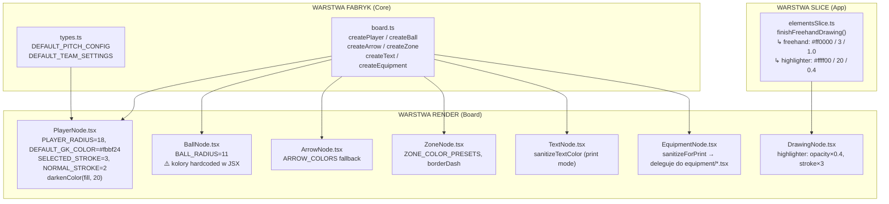

# 🎨 TMC Studio — Audyt Domyślnych Stylów Elementów Canvas

> **Data audytu:** 2026-06-09  
> **Zakres:** Wszystkie domyślne wartości wizualne (kolor, stroke, opacity) dla nowo tworzonych elementów na tablicy taktycznej  
> **Metodologia:** Analiza kodu źródłowego fabryk, renderów i slice'ów Zustand  
> **Status:** Raport wyłącznie opisowy — bez modyfikacji kodu

---

## 1. Główne Źródła Domyślnych Wartości

Początkowe wartości wizualne elementów są rozproszone w **czterech warstwach** aplikacji:

| # | Plik | Warstwa | Rola |
|---|------|---------|------|
| **F1** | `packages/core/src/board.ts` | **Fabryki (Core)** | Funkcje `createPlayer()`, `createBall()`, `createArrow()`, `createZone()`, `createText()`, `createEquipment()` — jedyne miejsce, gdzie powstają nowe obiekty elementów z domyślnymi właściwościami |
| **F2** | `apps/web/src/store/slices/elementsSlice.ts` | **Slice (App)** | Tworzenie rysunków odręcznych (`freehand`/`highlighter`) — **bez użycia fabryki**, wartości zaszyte inline |
| **F3** | `packages/board/src/*Node.tsx` | **Render (Board)** | Komponenty wizualne Konva — niektóre mają własne stałe i fallbacki niedostępne w danych elementu |
| **F4** | `packages/core/src/types.ts` | **Typy (Core)** | `DEFAULT_PITCH_CONFIG`, `DEFAULT_TEAM_SETTINGS` — stałe konfiguracyjne boiska i drużyn |
| **F5** | `packages/ui/src/colors.ts` | **UI (Shared)** | `SHARED_COLORS` — współdzielona paleta do cyklowania kolorów (Alt+↑/↓) |

### Diagram przepływu



---

## 2. Tabela Szczegółowa — Domyślne Wartości Według Typu Elementu

### 2.1 Player (Zawodnik)

| Właściwość | Wartość domyślna | Źródło |
|------------|-----------------|--------|
| **Kolor wypełnienia (fill)** — home | `#ef4444` (czerwony) | `types.ts:182` → `DEFAULT_TEAM_SETTINGS.home.primaryColor` |
| **Kolor wypełnienia (fill)** — away | `#3b82f6` (niebieski) | `types.ts:183` → `DEFAULT_TEAM_SETTINGS.away.primaryColor` |
| **Kolor bramkarza** | `#fbbf24` (żółty) | `PlayerNode.tsx:53` → `DEFAULT_GK_COLOR` |
| **Kolor obrysu (stroke)** | `darkenColor(fill, 20%)` — przyciemniony fill | `PlayerNode.tsx:92` |
| **Grubość obrysu (normalna)** | `2` | `PlayerNode.tsx:101` → `NORMAL_STROKE_WIDTH` |
| **Grubość obrysu (zaznaczony)** | `3` + kolor `#ffd60a` (złoty) | `PlayerNode.tsx:100,432` |
| **Kolor tekstu na graczu** | `secondaryColor` drużyny (`#ffffff`) | `PlayerNode.tsx:93` |
| **Promień** | `18` | `PlayerNode.tsx:97` → `PLAYER_RADIUS` |
| **Kształt** | home=`triangle`, away=`circle` | `board.ts:49` |
| **Orientacja** | `0` (północ/góra) | `board.ts:53` |
| **Vision cone opacity** | `0.28` | `PlayerNode.tsx:409` |
| **Vision cone strokeWidth** | `max(1, radius * 0.08)` | `PlayerNode.tsx:410` |

**Pliki:** `packages/core/src/board.ts:40-54`, `packages/core/src/types.ts:182-183`, `packages/board/src/PlayerNode.tsx:53,85-101,409-411`

---

### 2.2 Ball (Piłka)

| Właściwość | Wartość domyślna | Źródło |
|------------|-----------------|--------|
| **Promień** | `11` | `BallNode.tsx:22` → `BALL_RADIUS` |
| **Kolor wypełnienia** | `#ffffff` (biały) | `BallNode.tsx:143` — **hardcoded w JSX** |
| **Kolor obrysu** | `#1a1a1a` (ciemnoszary) | `BallNode.tsx:144` — **hardcoded w JSX** |
| **Grubość obrysu** | `2` / `2.5` (selected) | `BallNode.tsx:145` — **hardcoded w JSX** |
| **Kolor pięciokąta (środek)** | `#1a1a1a` | `BallNode.tsx:151` — **hardcoded w JSX** |
| **Kolor łatek zewnętrznych** | `#4a4a4a` | `BallNode.tsx:162` — **hardcoded w JSX** |
| **Cień** | `rgba(0,0,0,0.2)` | `BallNode.tsx:133` — **hardcoded w JSX** |
| **Krycie** | `1.0` | Brak pola opacity w typie `BallElement` |

> ⚠️ **Uwaga:** Fabryka `createBall()` w `board.ts:56-64` **nie ustawia żadnych właściwości wizualnych** — tworzy tylko `{ id, type: 'ball', position }`. Wszystkie kolory piłki są na sztywno w komponencie `BallNode.tsx`. Oznacza to, że użytkownik **nie może zmienić koloru piłki** przez Inspector.

**Pliki:** `packages/core/src/board.ts:56-64`, `packages/board/src/BallNode.tsx:22,133-164`

---

### 2.3 Arrow (Strzałka)

| Typ strzałki | Kolor | Grubość | Dash | Źródło |
|-------------|-------|---------|------|--------|
| **pass** | `#ffffff` (biały) | `4` | `[]` (ciągła) | `board.ts:82-83` |
| **run** | `#ffffff` (biały) | `3` | `[8, 4]` (przerywana) | `board.ts:86-87`, `ArrowNode.tsx:55` |
| **shoot** | `#ef4444` (czerwony) | `5` | `[]` (ciągła) | `board.ts:90-91` |

| Właściwość | Wartość domyślna | Źródło |
|------------|-----------------|--------|
| **Punkt końcowy (offset)** | `startPoint + (80, 0)` | `board.ts:103-104` |
| **Krycie** | `1.0` | Brak pola opacity w typie `ArrowElement` |
| **ARROW_COLORS (fallback)** | `{ pass: '#ffffff', run: '#ffffff', shoot: '#ef4444' }` | `ArrowNode.tsx:21-27` |

> ℹ️ Fallback `ARROW_COLORS` w `ArrowNode.tsx` jest zapasowy — fabryka zawsze dostarcza kolor, więc w praktyce nie jest używany.

**Pliki:** `packages/core/src/board.ts:69-110`, `packages/board/src/ArrowNode.tsx:21-27,53-55`

---

### 2.4 Zone (Strefa)

| Właściwość | Wartość domyślna | Źródło |
|------------|-----------------|--------|
| **Kolor wypełnienia** | `#ef4444` (czerwony) | `board.ts:125` |
| **Krycie** | `0.25` | `board.ts:126` |
| **Styl obramowania** | `'none'` (brak) | `board.ts:127` |
| **Szerokość** | `120` | `board.ts:122` |
| **Wysokość** | `80` | `board.ts:123` |
| **Kształt** | `'rect'` | `board.ts:115` |
| **Grubość obramowania** (gdy włączone) | `3` | `ZoneNode.tsx:211` |
| **Dash (gdy dashed)** | `[6, 3]` | `ZoneNode.tsx:69` |
| **Kolor obramowania** (gdy włączone) | `borderColor \|\| fillColor` | `ZoneNode.tsx:70` |

**Presety kolorów** (`ZoneNode.tsx:20-25`):

| Nazwa | Kolor |
|-------|-------|
| Green | `#22c55e` |
| Red | `#ef4444` |
| Yellow | `#eab308` |
| Blue | `#3b82f6` |
| Purple | `#a855f7` |
| Orange | `#f97316` |

**Pliki:** `packages/core/src/board.ts:113-128`, `packages/board/src/ZoneNode.tsx:20-25,69-70,211`

---

### 2.5 Text (Tekst)

| Właściwość | Wartość domyślna | Źródło |
|------------|-----------------|--------|
| **Kolor** | `#ffffff` (biały) | `board.ts:144` |
| **Treść** | `'Text'` | `board.ts:137` |
| **Rozmiar czcionki** | `18` | `board.ts:140` |
| **Rodzina czcionki** | `'Inter'` | `board.ts:141` |
| **Pogrubienie** | `false` | `board.ts:142` |
| **Kursywa** | `false` | `board.ts:143` |
| **Krycie** | `1.0` | Brak pola opacity w typie `TextElement` |

**Tryb druku (print mode):** `sanitizeTextColor()` w `TextNode.tsx:32-40` — białe `#ffffff` → czarne `#000000`

**Pliki:** `packages/core/src/board.ts:131-145`, `packages/board/src/TextNode.tsx:32-40`

---

### 2.6 Drawing (Rysunek odręczny / Highlighter)

| Typ | Kolor | Grubość | Krycie | Źródło |
|-----|-------|---------|--------|--------|
| **freehand** | `#ff0000` (czerwony) | `3` | `1.0` | `elementsSlice.ts:590-592` |
| **highlighter** | `#ffff00` (żółty) | `20` (×3 w renderze = `60`) | `0.4` (cap w renderze: `≤0.4`) | `elementsSlice.ts:590-592`, `DrawingNode.tsx:28-30` |

> ⚠️ **Uwaga:** Rysunki odręczne są tworzone **bezpośrednio w slice'cie** (`elementsSlice.ts:589-598`), nie przez fabrykę w `board.ts`. Nie istnieje funkcja `createDrawing()`. Wartości domyślne są zaszyte inline w kodzie slice'a. Dodatkowo `DrawingNode.tsx` nakłada własny mnożnik `×3` na `strokeWidth` highlightera.

**Pliki:** `apps/web/src/store/slices/elementsSlice.ts:589-598`, `packages/board/src/DrawingNode.tsx:28-30`

---

### 2.7 Equipment (Sprzęt treningowy)

**Fabryka:** `packages/core/src/board.ts:151-176` — `createEquipment()`

| Typ sprzętu | Kolor domyślny | Źródło |
|------------|---------------|--------|
| `goal` (bramka) | `#ffffff` | `board.ts:152` |
| `mannequin` (manekin) | `#fbbf24` | `board.ts:153` |
| `cone` (pachołek) | `#f97316` | `board.ts:154` |
| `ladder` (drabinka) | `#fbbf24` | `board.ts:155` |
| `hoop` (obręcz) | `#ef4444` | `board.ts:156` |
| `hurdle` (płotek) | `#22c55e` | `board.ts:157` |
| `pole` (tyczka) | `#f97316` | `board.ts:158` |

| Właściwość | Wartość domyślna | Źródło |
|------------|-----------------|--------|
| **Wariant** | `'standard'` | `board.ts:164` |
| **Rotacja** | `0` | `board.ts:172` |
| **Skala** | `1.0` | `board.ts:174` |
| **Krycie** | `1.0` | Brak pola opacity w typie `EquipmentElement` |

**Dodatkowe stałe wizualne w komponentach kształtów** (`packages/board/src/equipment/*.tsx`):

| Sprzęt | Kluczowe stałe |
|--------|---------------|
| **Goal** | `frontStroke: 4`, `backStroke: 1.5×scale`, `meshStroke: 0.6×scale` |
| **Cone** | `radius: 20×scale`, własny `stroke: #ffffff`, `strokeWidth: 1` |
| **Mannequin** | `STROKE_OUTER: 2.2`, `STROKE_INNER: 1.6`, `FILL_OPACITY: 0.18` |
| **Hoop** | `radius: 20×scale`, `strokeWidth: 4×scale`, `fill: transparent` |
| **Hurdle** | `width: 50×scale`, `height top: 5×scale`, `legs: 20×scale` |
| **Ladder** | `width: 40×scale`, `rungCount: 5`, `rungSpacing: 15×scale` |
| **Pole** | `width: 6×scale`, `height: 50×scale`, `cap radius: 5×scale` |

**Pliki:** `packages/core/src/board.ts:151-176`, `packages/board/src/EquipmentNode.tsx`, `packages/board/src/equipment/goal.tsx`, `packages/board/src/equipment/cone.tsx`, `packages/board/src/equipment/mannequin.tsx`, `packages/board/src/equipment/hoop.tsx`, `packages/board/src/equipment/hurdle.tsx`, `packages/board/src/equipment/ladder.tsx`, `packages/board/src/equipment/pole.tsx`

---

### 2.8 Podsumowanie zbiorcze

| Typ elementu | Domyślny kolor | Domyślny strokeWidth | Domyślne opacity |
|-------------|---------------|---------------------|-----------------|
| **Player (home)** | `#ef4444` (fill) | `2` (normal) / `3` (selected) | `1.0` |
| **Player (away)** | `#3b82f6` (fill) | `2` / `3` | `1.0` |
| **Goalkeeper** | `#fbbf24` (fill) | `2` / `3` | `1.0` |
| **Ball** | `#ffffff` (fill) | `2` / `2.5` (selected) | `1.0` |
| **Arrow (pass)** | `#ffffff` | `4` | `1.0` |
| **Arrow (run)** | `#ffffff` | `3` | `1.0` |
| **Arrow (shoot)** | `#ef4444` | `5` | `1.0` |
| **Zone** | `#ef4444` (fill) | `3` (tylko z border) | `0.25` |
| **Text** | `#ffffff` | — | `1.0` |
| **Drawing (freehand)** | `#ff0000` | `3` | `1.0` |
| **Drawing (highlighter)** | `#ffff00` | `20` (×3 = `60`) | `0.4` |
| **Goal** | `#ffffff` | `4` (front) | `1.0` |
| **Mannequin** | `#fbbf24` | `2.2` (outer) | `1.0` (fill: `0.18`) |
| **Cone** | `#f97316` | `1` (white stroke) | `1.0` |
| **Ladder** | `#fbbf24` | — | `1.0` |
| **Hoop** | `#ef4444` | `4×scale` | `1.0` (fill: `transparent`) |
| **Hurdle** | `#22c55e` | — | `1.0` |
| **Pole** | `#f97316` | — | `1.0` |

---

## 3. Paleta Współdzielona (SHARED_COLORS)

**Plik:** `packages/ui/src/colors.ts:7-14`

```typescript
export const SHARED_COLORS = [
  '#000000', // czarny
  '#ff0000', // czerwony
  '#ff6b6b', // jasnoczerwony
  '#00ff00', // zielony
  '#3b82f6', // niebieski
  '#eab308', // żółty
  '#f97316', // pomarańczowy
  '#ffffff', // biały
];
```

**Zastosowanie:** Cyklowanie kolorów (`Alt+↑` / `Alt+↓`) dla strzałek, tekstu i stref. W trybie druku (print mode) biały `#ffffff` jest filtrowany z palety.

---

## 4. Wnioski Architektoniczne

### 4.1 Rozproszenie odpowiedzialności

Domyślne wartości wizualne są zdefiniowane w **trzech różnych warstwach** aplikacji, bez jednego źródła prawdy (single source of truth):

| Problem | Opis |
|---------|------|
| **Fabryki vs Slice** | 6 typów elementów ma fabryki w `board.ts`, ale rysunki odręczne (`freehand`/`highlighter`) są tworzone inline w `elementsSlice.ts` — nie mają własnej funkcji `createDrawing()` |
| **Fabryki vs Render** | `BallNode.tsx` ignoruje wszelkie dane z elementu — kolory są na sztywno w JSX. Oznacza to, że użytkownik nie może zmienić koloru piłki, nawet gdyby pole `color` istniało w typie |
| **Podwójne fallbacki** | `ArrowNode.tsx` ma własną stałą `ARROW_COLORS` jako fallback, mimo że fabryka `createArrow()` zawsze dostarcza kolor — to martwy kod lub zabezpieczenie przed niekompletnymi danymi |
| **Mnożniki w renderze** | `DrawingNode.tsx` aplikuje mnożnik `×3` na `strokeWidth` highlightera — oznacza to, że wartość zapisana w stanie (`20`) różni się od wartości renderowanej (`60`) |

### 4.2 Elementy bez możliwości personalizacji koloru

Niektóre elementy nie mają pola `color` w swoim typie, co uniemożliwia użytkownikowi zmianę wyglądu przez Inspector:

- **Ball** — kolory wyłącznie w JSX `BallNode.tsx`
- **Drawing** — kolor ustawiany raz przy tworzeniu, brak możliwości późniejszej zmiany (brak w Inspector)

### 4.3 Niespójność w nazewnictwie

| Element | Pole koloru w typie |
|---------|---------------------|
| Arrow | `color` |
| Zone | `fillColor` |
| Text | `color` |
| Equipment | `color` |
| Player | (brak — kolor pochodzi z `teamSettings`) |

Brak jednolitego interfejsu — `Zone` używa `fillColor`, podczas gdy reszta używa `color`.

### 4.4 Rekomendacje (nieobjęte zakresem audytu)

Poniższe punkty mają charakter wyłącznie informacyjny — nie stanowią części bieżącego zadania:

1. Utworzenie fabryki `createDrawing()` w `board.ts` dla spójności z pozostałymi typami
2. Wyniesienie kolorów `BallNode` do właściwości elementu (pole `color` w typie `BallElement`)
3. Ujednolicenie nazewnictwa pól koloru (`color` vs `fillColor`)
4. Rozważenie centralnego pliku konfiguracyjnego `defaults.ts` w `packages/core/src/` jako pojedynczego źródła prawdy dla wszystkich domyślnych wartości

---

> **Podsumowanie:** Aplikacja TMC Studio definiuje domyślne wartości wizualne w ~13 plikach. Główne źródła to fabryki w `packages/core/src/board.ts` (6 typów), slice `elementsSlice.ts` (1 typ — drawing) oraz komponenty renderujące w `packages/board/src/` (fallbacki i stałe wizualne). Największym problemem architektonicznym jest `BallNode`, którego kolory są na sztywno w JSX, co uniemożliwia personalizację wyglądu piłki przez użytkownika.