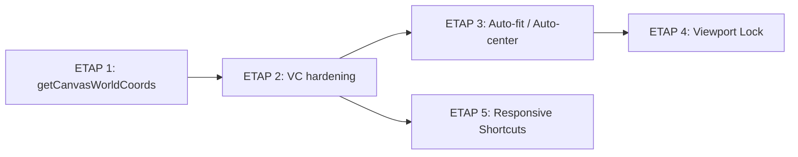

# PR-UX-3 — Virtual Canvas, Auto-fit/Center, Viewport Lock & Responsive Shortcuts

**Status:** ✅ Completed (ETAP 3, 4, 5 — implemented & merged; ETAP 1, 2 hardened in PR-FIX-4)
**Domain:** UX
**Branch target:** `feature/ux-3-virtual-canvas` (⚠️ currently on `develop`; create a feature branch before any edit — R-GIT)
**Source of truth:** `docs/MODULAR_ARCHITECTURE_STRATEGY.md`, `docs/SYSTEM_ARCHITECTURE.md` §11

> ℹ️ The `PR-UX-3-UNIFIED-COLOR-SHORTCUTS.md` slug is already used by a **completed** color-shortcuts PR. This document is the canonical plan for the **virtual-canvas / viewport** PR-UX-3 work and lives under its own filename to avoid clobbering history.

---

## 0. Context — What already exists (audit)

A previous Delivery pass (`thoughts/2026-06-09/2355_delivery_ux-p1-p4-cheatsheet-touch.md`) and **PR-FIX-4** already landed large parts of the virtual-canvas refactor. The plan below **consolidates and hardens** existing work rather than rebuilding it.

| Concern | Current state | File |
|--------|---------------|------|
| Stage = 100% viewport, `scale=1`, `x=y=0` | ✅ Done (PR-FIX-4) | `CanvasAdapter.tsx` |
| Zoom/pan via root `<Group scale={zoom} x={panX} y={panY}>` | ✅ Done (`groupZoom`, `groupPanX/Y`) | `CanvasElements.tsx` |
| `effectiveZoom = userZoom * fitZoom` | ✅ Done | `BoardCanvasSection.tsx` |
| Auto-fit on resize (`fitZoom` via ResizeObserver) | ✅ Done — raw comparison `curZoom > newFitZoom`, auto-centers pan on shrink | `BoardCanvasSection.tsx` |
| DOM flex containment (min-w-0, absolute inset-0) | ✅ Done — allows container to actually shrink | `BoardPage.tsx`, `BoardCanvasSection.tsx`, `CanvasShell.tsx` |
| Plain `+`/`-` zoom shortcuts (no Cmd) | ✅ Done — `+`/`=` → zoomIn, `-` → zoomOut, respects viewportLock | `useKeyboardShortcuts.ts` |
| Viewport lock ("kłódka") | ❌ Not implemented | — |
| Floating CheatSheet trigger | ✅ Done (compact, mobile bottom-sheet) | `CheatSheetOverlay.tsx` |
| Paginated/tabbed shortcuts (Elements/Edit/View/More) | ✅ Done — responsive tabs, each tab renders only active group | `CheatSheetOverlay.tsx` |

**Conclusion:** Feature 1 is ~80% done (needs hardening + `getCanvasWorldCoords` + kill direct pointer reads). Feature 2 needs centering/fit hardening. Feature 3 is greenfield. Feature 4 needs pagination on top of the existing floating panel.

---

## 1. Architectural guardrails (binding for every ETAP)

From `MODULAR_ARCHITECTURE_STRATEGY.md` + `SYSTEM_ARCHITECTURE.md` §11:

- **R-MVP:** simplest working solution, no new deps, no speculative abstraction.
- **UI → Commands only:** UI mutations go through `cmd.*` (CommandRegistry), never `store.getState().action()` directly.
- **UI reads via selectors/vm** — never raw store internals.
- **CommandRegistry is NOT a hook** — extend the existing singleton in `apps/web/src/commands/`.
- **Canvas layers MUST NOT import store** — they receive vm via props (`groupZoom`, `groupPanX/Y` already follow this).
- **`CanvasElements` stays pure** — no DOM nodes inside Konva (`
` → crash). Overlays (`
`) live OUTSIDE `<Stage>`, in `BoardPage`/`BoardCanvasSection` container.
- **One vertical slice per ETAP.** Each ETAP = independently buildable + committable.
- After any user-facing change → update `docs/FEATURE_SPEC.md` (mandatory).

> **Viewport-state placement decision:** zoom already lives in `useUIStore`. `viewportLocked` is pure UI/view state (not board data, not undoable) → it belongs in **`useUIStore`**, exposed to UI via selector and mutated via a new `cmd.view.toggleViewportLock()` command. We do **not** create a new slice (R-MVP).

---

## ETAP 1 — Coordinate mapping utility + kill direct pointer reads

**Goal:** Single source of truth for screen→world conversion. Eliminate crash-prone reliance on raw `stage.getPointerPosition()` for world coords.

### Files modified
- `apps/web/src/utils/viewportUtils.ts`
  - Add `getCanvasWorldCoords(stage, panX, panY, zoom): WorldPoint | null` as the **public** wrapper. Internally reuses the existing inverse-transform logic (already present as `getWorldPointer`). Keep `getWorldPointer` as a thin alias OR mark `@deprecated use getCanvasWorldCoords`.
  - JSDoc documents the True Virtual Canvas formula `world = (screen - pan) / zoom`.
- `apps/web/src/app/board/useBoardPageEffects.ts`
  - Replace the 3 direct `stage.getPointerPosition()` call sites (~L80, ~L106, ~L167) with `getCanvasWorldCoords(stage, groupPanX, groupPanY, effectiveZoom)`.
  - Requires current `panOffset` + `effectiveZoom` to be available to the effects hook (via stable ref/props from `BoardCanvasSection`/`BoardPage` — NOT read from store inside layers).
- `apps/web/src/utils/__tests__/viewportUtils.test.ts`
  - Add unit tests for `getCanvasWorldCoords` (scale=1 no pan, with pan, with zoom, fractional zoom) mirroring existing `screenToWorld` tests.

### Zustand changes
- None.

### CommandRegistry / UI changes
- None (pure utility + internal hook refactor).

### DoD
- [ ] `getCanvasWorldCoords` exported + unit-tested.
- [ ] Zero remaining app-level `getPointerPosition()` calls that compute world coords (utility-internal use allowed).
- [ ] `pnpm typecheck` + `pnpm build` green; existing canvas interactions (drag, marquee, drawing start) unchanged.

---

## ETAP 2 — True Virtual Canvas hardening (no-DOM-in-Konva guarantee)

**Goal:** Lock in the invariant that `<Stage>` never physically resizes and no DOM renders inside Konva, preventing `Konva error: You may only add groups and shapes to groups`.

### Files modified
- `apps/web/src/app/board/canvas/CanvasAdapter.tsx`
  - Enforce: `width={containerWidth}`, `height={containerHeight}`, `scaleX=1`, `scaleY=1`, `x=0`, `y=0`. Remove leftover `stageScale`/`stagePosition` props from the type & call sites (PR-FIX-4 legacy) if still present.
- `apps/web/src/app/board/canvas/CanvasElements.tsx`
  - Confirm the single root `<Group x={groupPanX} y={groupPanY} scaleX={groupZoom} scaleY={groupZoom}>` wraps ALL layers.
  - **Audit:** ensure no `
`, no HTML, no `<Html>`-style portals inside `<Stage>`. All overlays (selection HUD, edit inputs, empty-state) must be siblings of `<Stage>` in the DOM container, not children of Konva nodes.
- `apps/web/src/app/board/BoardCanvasSection.tsx`
  - Verify overlays/`CanvasShell` `emptyStateOverlay` render outside `<Stage>`.

### Zustand changes
- None.

### CommandRegistry / UI changes
- None.

### DoD
- [ ] Code review confirms no DOM node is a Konva child.
- [ ] Stage width/height equal container size at all zoom levels (dev-only `console.assert` or test).
- [ ] No regression in drag/select/draw; `pnpm build` green.

---

## ETAP 3 — Auto-fit on load + Auto-center on zoom-out & resize

**Goal:** Pitch fits perfectly on first load (with margin) and stays centered when zoomed out (<100%) or when the window resizes — never sticks to top-left.

### Files modified
- `apps/web/src/app/board/BoardCanvasSection.tsx`
  - **Auto-fit on load:** keep `fitZoom = min((W-pad)/canvasW, (H-pad)/canvasH, MAX_FIT_UPSCALE)`. Add a `hasInitializedRef` so the first valid `containerSize` triggers center + (optional) zoom reset to fit. Margin = existing `containerPadding` (16/24).
  - **Auto-center hardening:** replace the current `zoom <= 1`-only centering effect with a `recenter()` helper that runs:
    - on first valid container measurement,
    - whenever `containerSize` changes (resize),
    - whenever `zoom` drops to/below fit (≤1).
    `recenter()` computes `centerX/Y = (containerSize - canvas*effectiveZoom)/2`. At zoom>1, preserve the **world point at viewport center** (reuse `zoomToCursorPan` with screen center as anchor) so a resize doesn't jump the board.
  - Guard against feedback loops (only `setPanOffset` when value actually changes; epsilon compare).
- `apps/web/src/store/useUIStore.ts`
  - No new state required; `zoomFit()` already exists and resets `zoom = 1`. Centering handled by `BoardCanvasSection` effect reacting to the zoom change.

### Zustand changes
- None new. (`zoom`, `zoomFit`, `setZoom` already present.)

### CommandRegistry / UI changes
- None new for fit. (Fit button currently wired via `state.zoomFit`; routing it through `cmd.view.zoomFit` is a follow-up — see §4.)

### DoD
- [ ] First load: pitch centered + fully visible with margin on desktop & mobile.
- [ ] Resize (smaller/larger, portrait/landscape): pitch stays centered, no top-left stick, no clipping.
- [ ] Zoom out <100%: pitch re-centers.
- [ ] Zoom in >100% then resize: world point under viewport center stays roughly stable (no jump).
- [ ] `pnpm build` green; `docs/FEATURE_SPEC.md` viewport section updated.

---

## ETAP 4 — Viewport Lock ("Kłódka")

**Goal:** Padlock toggle that freezes wheel-zoom & pan so the user can manipulate tactical elements without moving the board. Element interactions (select/drag players, arrows) remain fully active.

### Files modified / created
- `apps/web/src/store/useUIStore.ts`
  - Add state: `viewportLocked: boolean` (default `false`).
  - Add actions: `toggleViewportLock: () => void`, `setViewportLock: (v: boolean) => void`.
  - **Persistence:** include `viewportLocked` in the `persist` partialize (UI prefs survive reload) — matches existing UI-prefs pattern.
- `apps/web/src/commands/types.ts`
  - Add a `view` sub-command group to `CommandRegistry` (or extend existing): `view.toggleViewportLock()`, `view.setViewportLock(v)`. (Keeps UI→commands rule; UI must NOT call `useUIStore.getState().toggleViewportLock()` directly.)
- `apps/web/src/commands/CommandRegistry.ts` (+ `registry.ts`)
  - Implement `view.toggleViewportLock` / `view.setViewportLock` delegating to `useUIStore`.
- `apps/web/src/app/board/BoardCanvasSection.tsx`
  - Read `viewportLocked` via selector (`useUIStore(s => s.viewportLocked)`).
  - **Wheel handler:** early-return when `viewportLocked` (no zoom).
  - **Space+drag pan:** early-return in `handleContainerPointerDown` when `viewportLocked`.
  - **Touch:** pass `locked` into `useTouchGestures` to disable pinch/two-finger pan when locked (single-tap/select still passes through to Stage).
  - Element drag/select untouched (handled by Konva node handlers, not container pan handlers).
- `apps/web/src/hooks/useTouchGestures.ts`
  - Add `locked?: boolean` param; guard pinch & two-finger pan on `locked`.
- `packages/ui/src/ZoomWidget.tsx` (preferred — co-locate with zoom controls)
  - Add a **padlock toggle button** (`LockIcon`/`UnlockIcon` inline SVG, Design System tokens) next to Fit. Props: `locked: boolean`, `onToggleLock: () => void`. `aria-pressed`, `aria-label`, focus ring, title "Lock view (prevents zoom/pan)".
- `apps/web/src/app/board/BoardPage.tsx`
  - Pass `locked={state.viewportLocked}` and `onToggleLock={() => cmd.view.toggleViewportLock()}` to `ZoomWidget` (via the board-page state aggregator; `cmd` is the stable registry ref).
- (Optional, R-MVP-gated) keyboard shortcut for lock — only if a free key exists; otherwise skip and note as follow-up.

### Zustand changes
| Store | Field | Type | Default | Actions |
|-------|-------|------|---------|---------|
| `useUIStore` | `viewportLocked` | `boolean` | `false` | `toggleViewportLock()`, `setViewportLock(v)` |

(Persisted in UI store `persist` partialize.)

### CommandRegistry / UI changes
- New: `cmd.view.toggleViewportLock()`, `cmd.view.setViewportLock(v)`.
- `ZoomWidget` gains lock toggle; reads `locked` (selector-fed prop), mutates via `cmd.view.*`.
- When locked: cursor reflects state (no `cursor-grab` even with Space held); padlock icon shows "closed".

### DoD
- [ ] Padlock toggles cleanly; state persists across reload.
- [ ] Locked: Ctrl/Cmd+wheel zoom disabled, Space+drag pan disabled, pinch/two-finger pan disabled.
- [ ] Locked: selecting & dragging players/arrows/zones still works.
- [ ] UI reads via selector, mutates via `cmd.view.*` (no direct store calls in UI).
- [ ] a11y: `aria-pressed`, keyboard-focusable, visible focus ring.
- [ ] `pnpm build` green; `docs/FEATURE_SPEC.md` updated with lock behavior.

---

## ETAP 5 — Responsive paginated Shortcuts tooltip

**Goal:** Compact, responsive shortcuts panel that doesn't overflow/block the board on small screens. Paginate the existing flat list into tabs/pages (**Elements / Edit / View / More**).

### Files modified
- `packages/ui/src/CheatSheetOverlay.tsx`
  - Keep floating trigger + `isVisible`/`expanded` sync (already good).
  - **Pagination model:** group the existing `shortcuts` sections into a small set of **tabs**:
    - Tab "Elements" → `Elements`
    - Tab "Edit" → `Edit`
    - Tab "View" → `View & Pitch`
    - Tab "More" → `Steps & Playback` (if `showAnimationShortcuts`) + `Export` + `Formations` + `Arrow Numbering`
  - Add `activeTab` `useState`; render only the active tab's sections. Tab bar = compact pill row (Design System tokens, horizontally scrollable on overflow).
  - Constrain panel: `w-[320px]` desktop, mobile bottom-sheet `max-h-[55vh]` with only the active tab visible → much shorter, never blocks the board.
  - a11y: `role="tablist"`/`role="tab"`/`aria-selected`, arrow-key navigation between tabs; `?` still toggles open/close.
  - Single source of truth: derive tabs from the existing `shortcuts` array (no duplication); `showAnimationShortcuts` still filters the animation section.

### Zustand changes
- None (panel open state already `cheatSheetVisible` in `useUIStore`, toggled via existing `toggleCheatSheet`).

### CommandRegistry / UI changes
- None new; existing `?`/Cmd+K toggle and mutex with Inspector preserved.
- `activeTab` is component-local UI state (ephemeral, not app state) — acceptable per R-MVP.

### DoD
- [ ] Panel shows one tab at a time; tab bar switches Elements/Edit/View/More.
- [ ] On 360px-wide mobile, panel never overflows viewport or blocks the board.
- [ ] Tabs keyboard-navigable; `?` toggles; animation tab hidden when flag off.
- [ ] Design System tokens only (no inline styles), animations via tokens.
- [ ] `pnpm build` green; `docs/FEATURE_SPEC.md` shortcuts section updated.

---

## 2. Cross-cutting: tests, docs, thoughts

- **Tests:** `viewportUtils.test.ts` extended (ETAP 1, 3). Optional lightweight RTL tests for `ZoomWidget` lock toggle and `CheatSheetOverlay` tab switching.
- **Docs (mandatory):** update `docs/FEATURE_SPEC.md` (viewport model, lock, shortcuts), `CHANGELOG.md`, `docs/INDEX.md` (link this file); create `tasks/PR-UX-3_COMPLETE.md` on completion.
- **Thoughts:** each ETAP leaves a `thoughts/YYYY-MM-DD/HHMM_[agent]_pr-ux-3-etapN.md` artifact.

## 3. Suggested commits (Conventional Commits)

| ETAP | Commit |
|------|--------|
| 1 | `refactor(canvas): add getCanvasWorldCoords and remove direct pointer reads` |
| 2 | `fix(canvas): enforce virtual canvas invariant, no DOM inside Konva` |
| 3 | `feat(canvas): auto-fit on load and auto-center on zoom-out/resize` → **PR-FIX-4** |
| 4 | `feat(ui): add viewport lock toggle (kłódka) via cmd.view` |
| 5 | `feat(ui): paginate keyboard shortcuts tooltip into responsive tabs` |

## 4. Actual commits (feature/ux-3-virtual-canvas branch)

| # | Commit | Description |
|---|--------|-------------|
| 1 | `c9c6b0d fix(canvas): auto-scale down pitch on window shrink` | Auto-scale-down via ResizeObserver |
| 2 | `cdcd8cf feat(ui): paginate keyboard shortcuts tooltip into responsive tabs` | ETAP 5 — paginated CheatSheet + tabs |
| 3 | `540f4f7 fix(canvas): repair ResizeObserver stale closure and CheatSheet CSS` | Fix stale closure + CheatSheet rendering |
| 4 | `ebda1cd fix(canvas): raw resize observer logic and add zoom shortcuts` | Simplified ResizeObserver + `+`/`-` shortcuts |
| 5 | `d6ac6fd fix(canvas): apply absolute DOM structure to allow canvas shrinking` | Fixed flex containment chain for ResizeObserver |
| 6 | *(fix escaped quotes)* | Fixed `\"` → `"` in BoardPage.tsx |

## 5. Files modified on feature/ux-3-virtual-canvas

- `apps/web/src/app/board/BoardPage.tsx`
- `apps/web/src/app/board/BoardCanvasSection.tsx`
- `apps/web/src/app/board/canvas/CanvasAdapter.tsx`
- `apps/web/src/hooks/useKeyboardShortcuts.ts`
- `apps/web/src/components/CanvasShell.tsx`
- `packages/ui/src/CheatSheetOverlay.tsx`
- `docs/FEATURE_SPEC.md`

## 6. Out of scope / follow-ups

- Routing existing zoom buttons (`zoomIn/Out/Fit`) through `cmd.view.*` (they currently call store actions). Note for a dedicated CommandRegistry consolidation PR.
- Dedicated keyboard shortcut for viewport lock (only if a free key is available).
- BoardCanvas (new canvas, `USE_NEW_CANVAS` flag) parity for lock — apply the same guards when that path is enabled.

---

## 5. ETAP dependency order

ETAP 5 depends only on ETAP 2 (independent of zoom/lock work) and may be parallelized after ETAP 2.
