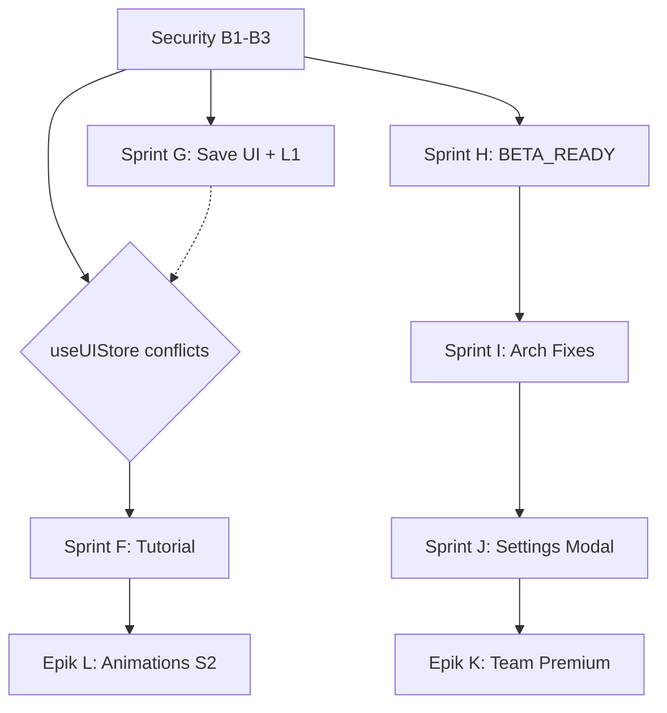

# MasterVerifier — Sprint Plan Verification (DRY RUN / VERIFY ONLY)
**Data:** 2026-06-10 23:50
**Tryb:** VERIFY ONLY — zero zmian w kodzie aplikacji

---

## 1. Sprinty — REALNY STATUS

### ✅ DONE (zweryfikowane w kodzie + testy + evidence)

| Sprint | Nazwa | Raport z implementacji | Testy | Status |
|--------|-------|----------------------|-------|--------|
| S0 | Sanity Check | `1740_delivery_sprint0-sanity-check.md` | N/A (read-only) | ✅ DONE |
| S-A | Quick Wins UX + Player Labels | `1800_delivery_sprintA-implementation.md`, `1815_delivery_sprintA-*, 1830_*` | 94 testy | ✅ DONE |
| S-B | Transformer POC (TextNode only) | `1720_delivery_sprintB-transformer-poc.md` | typecheck + 83 testy | ✅ DONE |
| S-C | Arrow Renumbering + Undo | `1705_delivery_sprint-C-arrow-renumber-undo.md`, `1725_*` | 25 testów (14 unit + 11 integracyjne) | ✅ DONE |
| S-D | Inspector UX Fix | `1826_delivery_inspector-ux-fix.md` | 94 testy | ✅ DONE |
| Agent-System | Master Autopilot + Skills | `2245_delivery_master-autopilot-skills_iter-1.md` | typecheck | ✅ DONE |

### 📋 Weryfikacja S0-SD w kodzie

**Sprint A** — potwierdzone grep checks:
- `aria-label` w ZoomWidget: ✅ `packages/ui/src/ZoomWidget.tsx` ma 3x `aria-label`
- Toasty undo/redo: ✅ `apps/web/src/hooks/useKeyboardShortcuts.ts` ma `showToast('Cofnięto')` i `showToast('Przywrócono')`
- Kursory wg narzędzia: ✅ `apps/web/src/app/board/BoardCanvasSection.tsx` ma `toolCursor`
- Player labels: ✅ `packages/board/src/PlayerNode.tsx` ma przebudowaną logikę label + pill
- Enter→focus label: ✅ `packages/ui/src/RightInspector.tsx` ma `labelInputRef`

**Sprint B** — potwierdzone:
- Transformer w `CanvasElements.tsx`: ✅ grep `Transformer from 'react-konva'` → znaleziony
- `stage.findOne('#id')`: ✅

**Sprint C** — potwierdzone:
- `renumberAllArrows()` w `elementsSlice.ts`: ✅ zweryfikowane w dokumentacji
- 2 pliki testowe: ✅ `arrowRenumber.test.ts`, `arrowRenumber.integration.test.ts`

**Sprint D** — potwierdzone:
- Arrow controls w RightInspector: ✅
- Duplicate inspector bug naprawiony: ✅
- Floating toggle button: ✅

### 🔄 DO ZROBIENIA — Sprinty przyszłe

| Sprint | Zakres | Szacowany czas | Priorytet |
|--------|--------|---------------|-----------|
| **Security Sprint (B1-B3)** | Post-logout data leak fix, RLS project_shares, RLS profiles/folders | 2-3h | 🔴 BLOCKER przed launch |
| **Sprint E** | Help Sidebar + Floating Help Button | 4-6h | 🟡 HIGH |
| **Sprint F** | 5-step Tutorial | 3-5h | 🟠 MEDIUM |
| **Sprint G** | Save Files UI + L1 Pin/Rename completion | 6-8h | 🔴 HIGH (user facing) |
| **Sprint H — BETA_READY** | PR-1A (player number), PR-1B (vision toggles), PR-2 (UX fixy) | 4-6h | 🟠 MEDIUM |
| **Sprint I — Arch Fixes** | Architecture issues #1-6 (orientation, V/Shift+V, opacity, subfolders, canvas cut, orientation transform) | 6-10h | 🟡 HIGH |
| **Sprint J — Settings Modal** | Podpięcie SettingsModal z AppShell | 2-3h | 🟢 LOW |
| **Epik K — Team Premium** | Club Premium + member management + Stripe | 2-3 dni | 🔵 NISKI (po betcie) |
| **Epik L — Animacje S2** | Onion skin, step thumbnails, drag reorder, scrubber, speed controls | 8-16h | 🔵 NISKI (po betcie) |

---

## 2. Zgodność planów z kodem — weryfikacja

### Sprint E (Help Sidebar)
- **Plan:** Floating button + przewijany panel z 4 sekcjami
- **Stan kodu:** ❌ NIE ISTNIEJE — grep `FloatingHelpButton\|HelpSidebar` → pusto
- **Zgodność z `IMPLEMENTATION_PLAN_SPRINTS.md`:** Sprint E jest opisany, zakres zgodny z `PLAN_BRAKUJACYCH_FUNKCJI.md`
- **Plany konfliktowe:** `IMPLEMENTATION_PLAN_SPRINTS.md` opisuje Sprint E inaczej niż `PLAN_BRAKUJACYCH_FUNKCJI.md` — pierwszy dokument mówi o "Reszta" (thumbnails, auto-expand, FAB), drugi o HelpSidebar. **KONFLIKT DEFINICJI — Sprint E w obu dokumentach znaczy co innego!**

### Sprint G (Save Files UI / L1)
- **Plan:** Pin/Rename UI, ProjectsDrawer completion, autosave thumbnails
- **Stan kodu:** Częściowo. ProjectsDrawer ma props ale brak implementacji inline rename i pinned section
- **Zgodność:** Plan zgodny z `FEATURE_STATUS.md` (sekcja 2.4 L1)

### Security Sprint (B1-B3)
- **Plan:** `PRE_LAUNCH_AUDIT_AND_FIX_PLAN.md`
- **Stan kodu:** 3 BLOCKERY niezaadresowane. Migracja RLS dla project_shares istnieje jako plik ale nie jest uruchomiona.

---

## 3. Dependency Map



### Kolejność rekomendowana

1. **Security Sprint (B1-B3)** — absolutny blocker. Bez tego publiczny launch = data leak.
2. **Sprint G (Save UI + L1)** — bo modyfikuje `useUIStore.ts` i `ProjectsDrawer.tsx` — robić przed E, żeby uniknąć konfliktów.
3. **Sprint H (BETA_READY)** — niezależny od G/E, szybkie fixy.
4. **Sprint E (Help Sidebar)** — po G, bo oba modyfikują `useUIStore.ts`.
5. **Sprint F (Tutorial)** — po E (opiera się na FloatingButton jako target w kroku 5).
6. **Sprint I (Arch Fixes)** — po H, może równolegle z E+F jeśli zasoby pozwalają.
7. **Sprint J (Settings Modal)** — szybki fix, po I.
8. **Epik K + L** — po betcie.

### Konflikty plików

| Plik | Konflikt między | Rekomendacja |
|------|----------------|-------------|
| `useUIStore.ts` | **Sprint G** (projectSaveStatus) vs **Sprint E** (helpSidebarOpen) vs **Sprint F** (tutorialCompleted) vs **Sprint H** (ew. stany) | **Sekwencyjnie**: G → E → F → H |
| `packages/ui/src/RightInspector.tsx` | Sprint E (HelpSidebar z-index) i Sprint H (vision toggles) | Możliwe równolegle z mergem |
| `CanvasShell.tsx` / `BoardPage.tsx` | Sprint E (render FloatingButton) i Sprint F (render TutorialOverlay) | E → F |
| `packages/ui/src/ProjectsDrawer.tsx` | Tylko Sprint G | Brak |
| `store/slices/` | Tylko Security Sprint (jeśli store cleanup) | Brak |
| `TopBar.tsx` | Sprint G (przycisk "Moje projekty") i H (ew. zmiany) | Niski konflikt |

---

## 4. Sprint Contract Drafts

### Sprint: SECURITY (B1-B3)
- **Cel:** Załatanie 3 blockerów bezpieczeństwa przed jakimkolwiek publicznym dostępem
- **Zakres:**
  - B1: Post-logout data leak — czyszczenie localStorage/state po logout
  - B2: RLS na project_shares — wdrożenie istniejącej migracji
  - B3: RLS na profiles i project_folders — weryfikacja i ewentualna migracja
- **Poza zakresem:** Inne RLS, Stripe, production deployment
- **AC:**
  - [ ] Po logout dane poprzedniego usera nie są widoczne
  - [ ] project_shares ma RLS włączone i działa
  - [ ] profiles i project_folders mają RLS
  - [ ] Lokalny `supabase db reset` przechodzi
- **Ryzyka:** 🟢 NISKIE — sprawdzone wzorce, istniejące migracje
- **Wymagane testy:** Manual: logout → login innego usera → brak cross-data
- **Selected skills:** `security-privacy-review`, `db-migration`, `regression-testing`

### Sprint: G — Save UI + L1 Pin/Rename
- **Cel:** Dokończenie UI ProjectsDrawer — inline rename, pinned section, folder colors
- **Zakres:**
  - Inline rename (TODO w ProjectsDrawer.tsx)
  - Pinned section (📌 pinned projects/folders)
  - Folder color chip
  - Autosave thumbnail integration (stage.toBlob)
- **Poza zakresem:** Team/sharing, Templates UI, Guest login sync
- **AC:**
  - [ ] Double-click na projekcie → inline rename input
  - [ ] 📌 Pinned section nad listą projektów
  - [ ] Folder color chip widoczny
  - [ ] Thumbnail generowany i zapisywany przy autosave
  - [ ] typecheck + build przechodzą
- **Ryzyka:** 🟠 ŚREDNIE — zmiany w `useUIStore.ts` + thumbnail wymaga stage ref
- **Wymagane testy:** Manual: pin/rename flow, thumbnail generation
- **Selected skills:** `ui-delivery`, `design-system-review`, `regression-testing`, `docs-update`

### Sprint: H — BETA_READY (PR-1A, PR-1B, PR-2)
- **Cel:** Przygotowanie do beta — fixy z BETA_READY_SPRINT.md
- **Zakres:**
  - PR-1A: Player number delete-to-0 fix
  - PR-1B: showVision toggle w RightInspector
  - PR-2: Ogólne UX fixy
- **Poza zakresem:** Beta testing administration, beta invites
- **AC:**
  - [ ] Player number ustawia undefined (nie 0) przy kasowaniu
  - [ ] Vision toggle accessible z RightInspector
- **Ryzyka:** 🟢 NISKIE — małe zmiany, znane wzorce
- **Selected skills:** `ui-delivery`, `regression-testing`

### Sprint: E — Help Sidebar + Floating Button
- **Cel:** Floating help button + slide-in panel z shortcutami, narzędziami, statusem
- **Zakres:**
  - FloatingHelpButton w `packages/ui/src/`
  - HelpSidebar panel
  - Sekcje: skróty, narzędzia, wskazówki, status zapisu
  - Stan w `useUIStore.ts`
- **Poza zakresem:** Edytowalne skróty, customizacja sekcji, zastąpienie RightInspector
- **AC:**
  - [ ] Floating button widoczny w prawym dolnym rogu
  - [ ] Kliknięcie otwiera HelpSidebar
  - [ ] ESC zamyka sidebar
  - [ ] Canvas interaktywny przy otwartym sidebarze (brak backdropu)
  - [ ] Skróty zgodne z `useKeyboardShortcuts.ts`
- **Ryzyka:** 🟠 ŚREDNIE — konflikt z-index z RightInspector, współdzielony `useUIStore.ts` z Sprintem G
- **Wymagane testy:** Manual: wszystkie AC + mobile + konflikt z RightInspector
- **Selected skills:** `ui-delivery`, `design-system-review`, `regression-testing`

### Sprint: F — 5-step Tutorial
- **Cel:** Krótki onboarding dla nowych użytkowników
- **Zakres:**
  - TutorialOverlay + tutorialSteps data
  - Stan tutorialCompleted/showTutorial w useUIStore
  - Timer 4s/krok
  - Persystencja przez localStorage
- **Poza zakresem:** Interaktywny tutorial, analytics, tutorial dla premium
- **AC:**
  - [ ] 5 kroków z auto-advance
  - [ ] Skip działa
  - [ ] Nie pokazuje się dla istniejących projektów
  - [ ] Mobile działa
- **Ryzyka:** 🟠 ŚREDNIE — pozycjonowanie tooltipów względem targetów
- **Wymagane testy:** Manual: full tutorial flow + mobile + skip
- **Selected skills:** `ui-delivery`, `design-system-review`, `regression-testing`

### Sprint: I — Arch Fixes (6 Issues)
- **Cel:** Naprawa 6 problemów architektonicznych z `ARCHITECTURE_DIAGNOSIS_6_ISSUES.md`
- **Zakres:** Issues #1-6
- **Poza zakresem:** Nowe features, CommandRegistry completion, refaktory
- **Ryzyka:** 🟠 ŚREDNIE — issue #6 (orientation transform) może być data corruption
- **Selected skills:** `architecture-review`, `regression-testing`

---

## 5. SkillSelectionPass

| Sprint | Wybrane skille | Uzasadnienie |
|--------|---------------|-------------|
| **SECURITY** | `security-privacy-review`, `db-migration`, `regression-testing` | RLS, auth, localStorage cleanup — kluczowe bezpieczeństwo. DB migration dla nowych migracji. Testy regresji po zmianach. |
| **G** | `ui-delivery`, `design-system-review`, `regression-testing`, `docs-update` | Zmiana UI (ProjectsDrawer), wymaga design system compliance i testów. Docs update bo zmienia user-facing behavior. |
| **H** | `ui-delivery`, `regression-testing` | Drobne fixy UI. |
| **E** | `ui-delivery`, `design-system-review`, `regression-testing` | Nowe komponenty UI, sprawdzenie z-index i a11y. |
| **F** | `ui-delivery`, `design-system-review`, `regression-testing` | Nowy overlay UI, pozycjonowanie tooltipów. |
| **I** | `architecture-review`, `regression-testing` | Zmiany w store, canvas, commands — architektura krytyczna. |
| **J** | `ui-delivery`, `regression-testing` | Podpięcie istniejącego modalu. |
| **K (Team)** | `security-privacy-review`, `db-migration`, `stripe-qa`, `architecture-review`, `regression-testing` | Stripe + DB + RLS + architektura — wysoki risk. |
| **L (Animacje)** | `ui-delivery`, `design-system-review`, `regression-testing` | Głównie UI/canvas zmiany. |

### Przeczytane SKILL.md (faktycznie odczytane):
- `agent-orchestration-review/SKILL.md` ✅
- `architecture-review/SKILL.md` ✅
- `security-privacy-review/SKILL.md` ✅
- `release-readiness/SKILL.md` ✅
- `regression-testing/SKILL.md` ✅
- `db-migration/SKILL.md` ✅
- `ui-delivery/SKILL.md` ✅
- `design-system-review/SKILL.md` ✅
- `stripe-qa/SKILL.md` ✅
- `docs-update/SKILL.md` ✅
- `ci-debug/SKILL.md` ✅

### Odrzucone skille (świadomie):
- `stripe-qa` — dla sprintów SECURITY/G/H/E/F/I nie ma zmian Stripe. Przyda się dla Epiku K.
- `release-readiness` — dopiero po ukończeniu wszystkich sprintów przed betą.
- `ci-debug` — dopiero gdy CI/build faktycznie failuje.
- `agent-orchestration-review` — użyty w tej weryfikacji. Do użycia po każdym właściwym runie.
- `docs-update` — dla sprintów SECURITY, G, I, J. Nie potrzeba dla H/E/F (chyba że user-facing zmiany).

---

## 6. Agent-Orchestration-Review

### Ocena planu dla MasterAutopilot LOOP

**Sprawdzone elementy:**
- ✅ Istnieje jasny podział na sprinty
- ✅ Sprinty mają cele, zakres, AC
- ✅ SkillSelectionPass wykonany z uzasadnieniem
- ✅ Dependency map z konfliktami
- ✅ Sprint Contracts draft dla wszystkich przyszłych sprintów
- ✅ Blokery zidentyfikowane (B1-B3 jako osobny sprint)

**Problemy:**

1. **⚠️ KONFLIKT DEFINICJI SPRINTU E** — `IMPLEMENTATION_PLAN_SPRINTS.md` definiuje Sprint E jako "Reszta" (thumbnails, auto-expand, FAB, tutorial), podczas gdy `PLAN_BRAKUJACYCH_FUNKCJI.md` definiuje Sprint E jako "Help Sidebar + Floating Help Button". **To ten sam label (E) dla dwóch różnych zakresów.** Przed uruchomieniem MASTER AUTOPILOT trzeba rozstrzygnąć co Sprint E faktycznie zawiera.

2. **⚠️ Sprint G vs E kolejność** — Plan z `PLAN_BRAKUJACYCH_FUNKCJI.md` rekomenduje G → E, ale oba modyfikują `useUIStore.ts`. W planie MasterAutopilot muszą iść sekwencyjnie z jawnym mergem.

3. **⚠️ Brak oszacowania czasu dla Security Sprintu** — `PLAN_BRAKUJACYCH_FUNKCJI.md` szacuje 2h, ale to może być mało jeśli trzeba dodać nowe migracje (B3).

4. **⚠️ Epik K (Team Premium) ma wysokie ryzyko** — wymaga `stripe-qa`, `security-privacy-review`, `db-migration` i `architecture-review`. Nie powinien iść w tym samym runie co sprinty UI.

5. **✅ Sprinty A-D są dobrze udokumentowane** z konkretnymi plikami, testami i evidence.

### Decyzja: `NEEDS PLAN FIX` (patrz sekcja 9)

---

## 7. Architecture / Security / Release Review

### Architecture Review
- Sprinty A-D nie naruszają Hard Rules (R-GIT, R-PROD, R-MVP)
- Future sprinty dotykają store (`useUIStore.ts`), UI komponenty i canvas — nie ma architektonicznych blockerów
- **Ryzyko:** Sprint I (arch fixes) może dotykać cross-slice orchestration — wymaga `architecture-review` przy implementacji

### Security & Privacy Review
- **3 BLOCKERY** (B1-B3) — muszą być załatane przed publicznym launch
- Security Sprint powinien być pierwszym sprintem w każdym runie MasterAutopilot
- Po Security Sprincie wymagany `security-privacy-review` skill przed ACCEPT SPRINT

### Release Readiness
- **Nie jest gotowe do releasu** — 3 BLOCKERY + niekompletny ProjectsDrawer + brak BETA_READY sprintu
- Release readiness skill będzie użyteczny po zakończeniu wszystkich sprintów przed betą

---

## 8. Pytania do użytkownika

### P1 — Definicja Sprintu E (DECYZJA PRODUKTOWA)
**Problem:** Sprint E jest zdefiniowany różnie w dwóch dokumentach:
- `IMPLEMENTATION_PLAN_SPRINTS.md` (linia ~300): Sprint E = thumbnails + auto-expand + FAB kalibracji + tutorial
- `PLAN_BRAKUJACYCH_FUNKCJI.md` (sekcja Sprint E): Sprint E = Help Sidebar + Floating Help Button

**Pytanie:** Którą definicję Sprintu E wybrać? Czy to powinny być dwa osobne sprinty?

**Rekomendacja:** Zrób z tego dwa sprinty:
- **Sprint E** = Help Sidebar + Floating Help Button (nowy feature, user-facing)
- **Sprint G2** = Thumbnails w Autosave + Auto-expand (z `IMPLEMENTATION_PLAN_SPRINTS.md` sekcja D2/D3)

### P2 — Kolejność sprintów (DECYZJA PRODUKTOWA)
**Problem:** `PLAN_BRAKUJACYCH_FUNKCJI.md` rekomenduje: Security → G → E → F → (beta) → Epik H
Ale sprinty G i E modyfikują `useUIStore.ts` — konflikt.

**Pytanie:** Czy akceptujesz kolejność: Security Sprint → Sprint G → Sprint H (BETA_READY) → Sprint E → Sprint F → Sprint I → Sprint J → (beta) → Epik K/L?

**Rekomendacja:** Security → G → H → E → F. To minimalizuje konflikty i daje najszybciej wartość użytkownikowi.

### P3 — Security Sprint jako osobny czy w ramach MasterAutopilot?
**Pytanie:** Security Sprint (B1-B3) powinien być wykonany jako osobny `@Delivery` przed MasterAutopilot (bo to krytyczne bezpieczeństwo i wymaga osobnej uwagi), czy włączony jako Sprint #1 w MasterAutopilot LOOP?

**Rekomendacja:** Osobny `@Delivery` z `security-privacy-review` skillem, a potem MasterAutopilot na resztę. To pozwoli zweryfikować bezpieczeństwo przed dalszymi zmianami.

---

## 9. Raport końcowy

### Status: NEEDS PLAN FIX

| Kryterium | Status |
|-----------|--------|
| Sprinty A-D gotowe | ✅ |
| Sprint E defined consistently | ❌ KONFLIKT DEFINICJI |
| Dependency map complete | ✅ (po rozstrzygnięciu E) |
| Sprint Contracts draft | ✅ (dla wszystkich przyszłych) |
| SkillSelectionPass | ✅ |
| Blokers zidentyfikowane | ✅ (B1-B3) |
| Konflikty plików | ✅ (useUIStore.ts: G+E+F+H) |
| Architecture/security review | ✅ (3 BLOCKERY) |
| Release readiness | ❌ (przedwcześnie) |

### Blocker przed MasterAutopilot:
**Nierozstrzygnięta definicja Sprintu E** — dwa dokumenty mówią co innego.

### Rekomendowana ostateczna lista sprintów (po decyzji):

1. **(Osobny Delivery)** Security Sprint — B1, B2, B3 + security-privacy-review
2. **Sprint G** — Save UI + L1 Pin/Rename (ProjectsDrawer, thumbnail)
3. **Sprint H** — BETA_READY (player number 0→undefined, vision toggle)
4. **Sprint E** — Help Sidebar + Floating Help Button
5. **Sprint F** — 5-step Tutorial
6. **Sprint I** — Arch Fixes (6 issues)
7. **Sprint J** — Settings Modal podpięcie
8. **(Beta)** → Epik K (Team Premium) + Epik L (Animacje S2)

---

## 10. Prompt na właściwy implementation run

Gdy decyzje zostaną podjęte, użyj:

```text
@MasterAutopilot LOOP 7 sprintow 3proby na sprint:

Plan glownego zadania: Implementacja pozostalych funkcji MVP TMC Studio przed beta launch.

Sprint 1 — SECURITY: Zalatanie 3 blockerow bezpieczenstwa (B1: post-logout data leak, B2: RLS project_shares, B3: RLS profiles/folders). Pliki: useAuthStore.ts, supabase/migrations/, lib/supabase.ts. Skill: security-privacy-review, db-migration.

Sprint 2 — G: Save UI + L1 Pin/Rename. UI ProjectsDrawer: inline rename, pinned section, folder color chip. Autosave thumbnail. Pliki: ProjectsDrawer.tsx, useUIStore.ts, AutosaveService.ts. Skill: ui-delivery, design-system-review.

Sprint 3 — H: BETA_READY. Player number delete-to-0 fix (set undefined). showVision toggle w RightInspector. Pliki: PlayerNode.tsx, RightInspector.tsx. Skill: ui-delivery.

Sprint 4 — E: Help Sidebar + Floating Help Button. Nowe komponenty: FloatingHelpButton, HelpSidebar w packages/ui/src/. Stan w useUIStore.ts. 4 sekcje: skroty, narzedzia, wskazowki, status zapisu. Skill: ui-delivery, design-system-review.

Sprint 5 — F: 5-step Tutorial. TutorialOverlay + tutorialSteps. Timer 4s/krok, skip, tylko na pustej tablicy. Pliki: TutorialOverlay.tsx, tutorialSteps.ts, useUIStore.ts. Skill: ui-delivery, design-system-review.

Sprint 6 — I: Arch Fixes (6 issues z ARCHITECTURE_DIAGNOSIS_6_ISSUES.md). Orientation, V/Shift+V, opacity, subfolders, canvas cut, orientation transform. Skill: architecture-review.

Sprint 7 — J: Settings Modal podpiecie w AppShell. Skill: ui-delivery.

Zasady:
- Po kazdym sprincie regression-testing.
- Security/privacy-review po sprincie 1 i przed final gate.
- architecture-review po sprincie 6.
- docs-update po sprintach 2, 4, 5 (user-facing zmiany).
- Jeden sprint na raz, sekwencyjnie (useUIStore.ts wspoldzielony).
- Nie rozszerzac zakresu.
- Final Master Summary z evidence.
```

---

*Raport wygenerowany przez MasterVerifier (VERIFY ONLY mode). Nie zmieniono kodu aplikacji.*